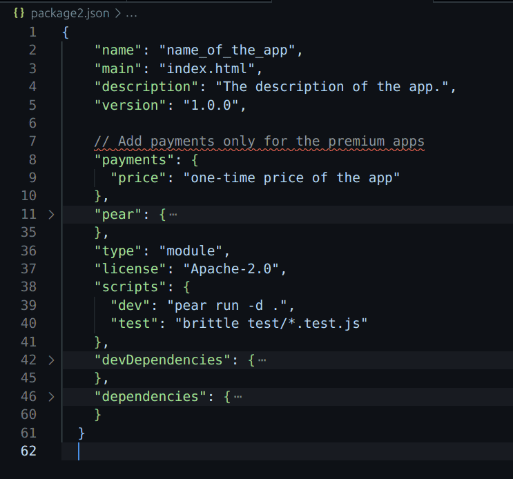

# Alaric

An app store for decentralized peer-to-peer apps built with Pear.

It is a lightweight and efficient pear application store built on Hyperswarm and Hypercore technologies.

Hyperswarm facilitates connections between multiple peers, while Hypercore provides a secure, append-only log for storing globally added apps, rooms on Keet, and premium applications.

<!-- ## Screenshots

 -->

## Click to watch the Video
[](https://youtu.be/ujH9ubN5jyc)


## Features

- **Pear App & Room Store** - Run and manage all Pear apps and rooms in one place.
- **Decentralized by Design** - do not depend on centralized servers.
- **User Friendly** - Simple, innovative, and efficient UI for smooth navigation
- **Lightning Payment** - allowing the premium apps to run after one time payment using Sats

## 🔥 Important Notice

If you are adding a pear app in **Alaric**, ensure your app's `package.json` is like this : 

1. For a normal pear app

```bash
{
    "name": "name_of_the_app",
    "description": "the description of the app",
}
```

2. For a premium pear app

```bash
{
    "name": "name_of_the_app",
    "description": "the description of the app",
    "payments": {
        "price": 100,
    }
}
```
### For example



## Tech Stack

**Frontend:** Pear Framework - HTML, CSS, JavaScript

**Networking:** [hyperswarm](https://docs.pears.com/building-blocks/hyperswarm) - A distributed networking stack for connecting pears.

**Data Storage:** [hypercore](https://docs.pears.com/building-blocks/hypercore) - append-only log for storing data

**Payment System:** Lightning Network([Voltage](https://voltage.cloud)) - Bitcoin micropayments for in-app transactions using QR codes.

**Security:** [hypercore-crypto](https://github.com/holepunchto/hypercore-crypto) - Encryption and cryptographic verification for secure data transmission.

**Designing:** [Figma](https://www.figma.com/design/2DX8bjRL8jlHbOTyzKkaaJ/Alaric?node-id=29-2&t=AKwMjqiOuJJKrF84-1) - Designed the Icon, Wireframe and Layout of Alaric.


## Architecture

The Alaric consists of three primary layers : 

**Network Layer:** Powered by HyperSwarm, this layer handles peer discovery and direct communication between nodes. Each peer joins a shared swarm to broadcast its presence and connect to other users.

**Data Layer:** HyperCore provides an append-only log system where data is securely stored and distributed. Each peer maintains its own data logs, making the system fully distributed without a single point of failure.

**Application Layer:** The frontend interacts with the network and data layers through the Pear Framework, enabling features like app sharing, terminal execution, and caching. This layer also integrates encryption protocols to ensure secure data transfers.


## Installation and Setup

Make sure [pear](https://docs.pears.com) is installed in your system, if not then

```bash
npm i pear -g
```

To run the Alaric app in your system.
The app-link will be shared by the user.

```bash
pear run pear://<app-link>
```

## Clone and Install Dependencies

make sure all the dependencies are installed.
```bash
git clone https://github.com/Codesamp-Rohan/alaric.git
cd alaric
npm install
```
after cloning Alaric, to run the application.
```bash
pear run -d .
```
this is going to run your application locally.

## Stage, Release and Seed
Now if you want to share the application with other.
```bash
pear stage dev
pear release dev
pear seed dev
```
you will get the pear-key which is shareable.

## Future Improvement and Implementation

**Payment Improvement:** Full Lightning Network integration with user wallets, balance tracking, and payment history.

**UI/UX Enhancements:** Implementing different themes.

**Advanced Access Controls:** Admin access to control the application and its data.

**Third-Party Plugin Support:** Allowing developers to create custom plugins for extending functionality.

##

Developed by: Rohan — Co-Founder of Holesail